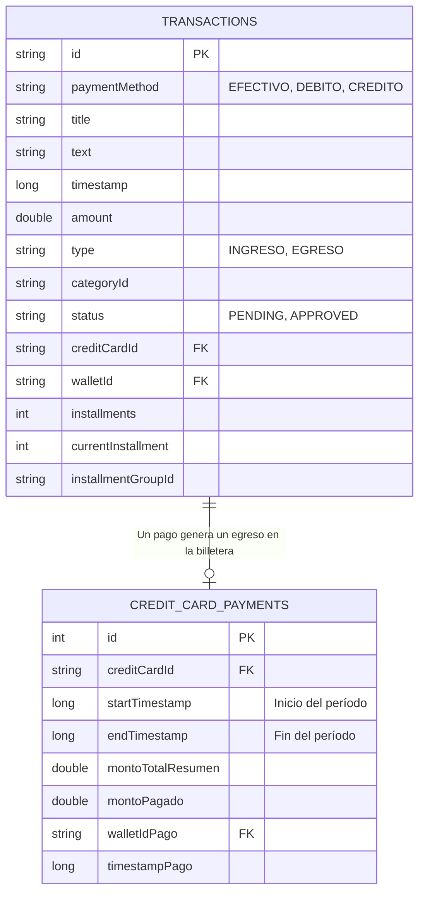

# Documentación de la Base de Datos

Este proyecto utiliza **Room Persistence Library** para la persistencia de datos financieros. A continuación se detalla la estructura de las tablas y sus relaciones.

## Diagrama Entidad-Relación (E-R)

## Descripción de Tablas

### 1. `transactions`
Almacena todos los movimientos financieros (Ingresos, Egresos y Gastos con Tarjeta).
- **id**: UUID único de la transacción.
- **paymentMethod**: Define si es Efectivo, Débito o Crédito.
- **status**: `APPROVED` para transacciones confirmadas, `PENDING` para notificaciones capturadas pendientes de revisión.
- **creditCardId / walletId**: Referencias a las cuentas (almacenadas externamente).
- **Cuotas**: Campos `installments` y `currentInstallment` gestionan compras en cuotas.

### 2. `credit_card_payments`
Registra los pagos realizados a tarjetas de crédito.
- **creditCardId**: Identificador de la tarjeta pagada.
- **startTimestamp**: Marca de tiempo que identifica el período de facturación.
- **montoPagado**: El monto real entregado.
- **walletIdPago**: Referencia a la cuenta de donde salió el dinero para el pago.

---

## Notas de Implementación
- **Cálculo de Deuda**: La deuda de tarjeta se calcula dinámicamente comparando la suma de gastos en `transactions` contra la suma de pagos en `credit_card_payments` para un `creditCardId` específico.
- **Índices**: Se han implementado índices en `creditCardId` y `timestamp` para optimizar el rendimiento en consultas históricas.
- **Conversiones**: Los enums (`PaymentMethod`, `IngresoOEgreso`) se almacenan como Strings mediante `Converters`.
