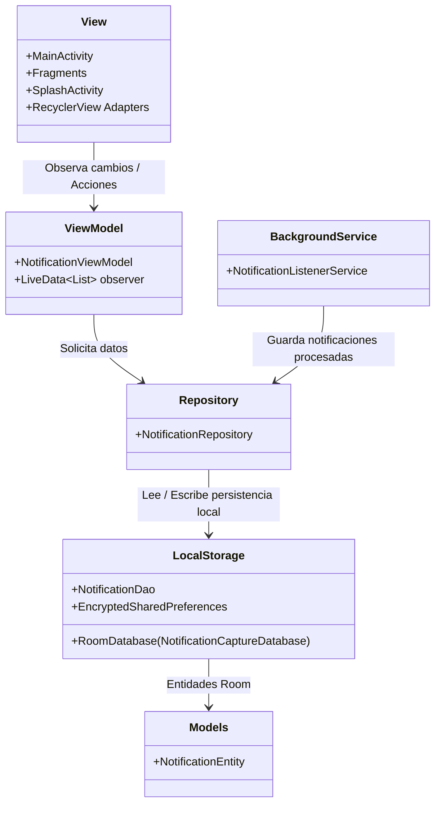

# Resumen del Proyecto: NotificationCapture

## 1. Tecnologías Usadas

El proyecto está construido puramente en Android Nativo, enfocado en el rendimiento y buenas prácticas de arquitectura:

*   **Lenguaje:** Java 11.
*   **Plataforma:** Android Nativo (Min SDK 21, Target SDK 34).
*   **Arquitectura:** MVVM (Model-View-ViewModel) promoviendo la separación de responsabilidades (Clean Architecture).
*   **Persistencia de Datos:**
    *   **Room Persistence Library:** ORM respaldado por SQLite para el almacenamiento transaccional local de las notificaciones e historial.
    *   **AndroidX Security Crypto:** Preferencias compartidas cifradas (`EncryptedSharedPreferences`) para salvaguardar información sensible u opciones críticas.
*   **Gestión del Ciclo de Vida:** Jetpack Lifecycle (`ViewModel`, `LiveData`) para observar datos en tiempo real de maneral reactiva sin provocar fugas de memoria (memory leaks).
*   **Componentes de UI:** Material UI, AndroidX AppCompat y ConstraintLayout para diseños responsivos y eficientes en renderizado.
*   **Servicios Core:** `NotificationListenerService` para interceptar las notificaciones push del sistema operativo en segundo plano.
*   **Testing:** JUnit y Robolectric (pruebas unitarias/lógica) e Espresso (pruebas UI).

---

## 2. Diagrama Arquitectónico (UML)



---

## 3. Flujo Lógico de Funcionamiento

El funcionamiento fundamental de la aplicación se divide en las siguientes fases coordinadas:

1.  **Arranque (Splash Init):**
    *   Al iniciar, `SplashActivity` muestra la pantalla inicial antes de dirigir al usuario a la vista principal.
2.  **Validación de Permisos (Main UI):**
    *   `MainActivity` gestiona la carga de vistas. Lo primero que corrobora es si el usuario otorgó el permiso de **Acceso a las Notificaciones** (Notification Access). De no tenerlo, solicita explícitamente el permiso.
3.  **Captura en Segundo Plano:**
    *   Una vez que el acceso es otorgado, la clase `NotificationListener` (actuando como servicio en background del sistema) intercepta todos los eventos "OnNotificationPosted" lanzados por otras apps compatibles.
4.  **Filtrado y Mapeo:**
    *   Dentro de `NotificationListener`, las notificaciones crudas se filtran basándose en *keywords*, paquetes permitidos, y reglas de negocio para rechazar publicidad, información irrelevante o duplicados y convertir los datos limpios en la entidad (`NotificationEntity`).
5.  **Persistencia y Repositorio:**
    *   Una vez validadas, son enviadas al `NotificationRepository`, el cual ejecuta una capa de persistencia en Room DB usando el Dao asincrónico correspondiente.
6.  **Reactividad de UI:**
    *   La inserción desencadena una actualización en `LiveData` manejada por el `ViewModel`. La `View` (Fragmento/Actividad) escucha este cambio y refresca el `Adapter` de la vista casi en tiempo real, reflejándole al usuario la nueva información capturada sin bloqueos de la UI principal.


## 4. Onboarding y Consentimiento

```
SplashActivity (3 seg)
    │
    ├─ ¿Ya aceptó los términos vigentes?
    │       NO  ──► OnboardingActivity
    │                   Página 1 → Bienvenida
    │                   Página 2 → Cargar ingresos / egresos
    │                   Página 3 → Categorías y balance
    │                   Página 4 → Captura de notificaciones
    │                   Página 5 → Términos y Política de Privacidad
    │                                   │
    │                                   └─ [Checkbox + Aceptar] ──► MainActivity
    │
    └─ SÍ ──────────────────────────────────────────────────────────► MainActivity
                                                                          │
                                                                   AdManager.maybeShowAd()
                                                                   (máx. 1 vez por semana)
```
